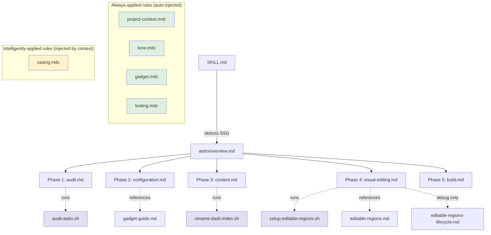

# CloudCannon Agent Tooling

AI agent tooling for migrating existing SSG sites to [CloudCannon](https://cloudcannon.com) -- a git-based CMS.

This repo contains Cursor skills, rules, and scripts that teach AI agents how to take an existing static site and make it work well with CloudCannon. The goal is to package this tooling so it can be given to prospective customers, letting an AI agent guide them through onboarding.

## How it works

We develop the tooling by working through real site templates:

1. Pick an existing SSG template that has no CloudCannon knowledge
2. Add the untouched template to `templates/<name>/pristine/` and copy it to `templates/<name>/migrated/`
3. Use an AI agent (armed with our skills and rules) to migrate `migrated/`
4. Review the result and refine the skills, rules, and scripts based on what we learn

The skills and rules are **living documents** -- agents are expected to update them as they discover new patterns, edge cases, or better approaches.

## Repository structure

```
.cursor/
  rules/                              # Cross-cutting agent rules
    project-context.md                # Repo purpose and working philosophy (alwaysApply)
    tone.md                           # Agent tone and coding conventions (alwaysApply)
    testing.md                        # What agents vs. humans should test (alwaysApply)
    casing.md                         # Naming conventions (applyIntelligently)
  skills/
    migrating-to-cloudcannon/         # Main migration workflow skill
      SKILL.md                        # Entry point -- detects SSG, routes to SSG guide
      gadget-guide.md                 # Core reference: Gadget CLI
      editable-regions.md             # Core reference: editable region types and API
      editable-regions-lifecycle.md   # Core reference: lifecycle and internals
      astro/                          # Astro-specific migration guide
        overview.md                   # Astro entry point with phase links
        audit.md                      # Phase 1: Analyze the Astro site
        configuration.md              # Phase 2: cloudcannon.config.yml for Astro
        content.md                    # Phase 3: Content review for Astro
        visual-editing.md             # Phase 4: Visual editor setup for Astro
        build.md                      # Phase 5: Build and validate for Astro
      scripts/                        # Deterministic migration scripts
        audit-astro.sh                # Phase 1: Gather audit data (Gadget + supplements)
        rename-dash-index.sh          # Phase 3: Rename -index.md to index.md
        setup-editable-regions.sh     # Phase 4: Install + configure editable regions

templates/
  astroplate/
    pristine/                         # Untouched original (never modify)
    migrated/                         # Agent works here
```

## Agent reading order

When a user asks an agent to migrate a site, Cursor loads files in layers. Understanding this order helps when authoring or reviewing the tooling.

### Dependency graph



### Layer breakdown

| Layer | Files | When loaded |
|-------|-------|-------------|
| 1. Always-applied rules | `project-context`, `tone`, `gadget`, `testing` | Every conversation, automatically |
| 2. Skill entry point | `SKILL.md` | Agent recognizes migration intent |
| 3. SSG overview | `astro/overview.md` | Agent follows link from SKILL.md |
| 4. Phase docs | `audit`, `configuration`, `content`, `visual-editing`, `build` | Sequentially as work progresses |
| 5. Scripts | `audit-astro.sh`, `rename-dash-index.sh`, `setup-editable-regions.sh` | Invoked by phase docs during execution |
| 6. Reference docs | `gadget-guide`, `editable-regions` | On-demand when a phase doc references them |
| 7. Debug reference | `editable-regions-lifecycle` | Only if debugging unexpected editable region behavior |
| 8. Intelligent rules | `casing` | Cursor injects when it deems relevant |

The ideal agent reads phase docs just-in-time rather than front-loading all reference docs at once. The lifecycle doc should only be read when troubleshooting.

## Key principles

**Scripts first**: Anything deterministic and repetitive should be a script, not an agent task. This saves tokens, improves consistency, and makes the process more predictable.

**Skills vs. rules vs. scripts**:
- **Rules** are cross-cutting conventions that agents should always or contextually know (naming, tone, testing approach)
- **Skills** are procedural workflows with ordered steps (the migration process)
- **Scripts** are standalone automation that skills can invoke

**Graduated structure**: Reference docs inside a skill start small and grow. When they exceed ~300 lines or need their own scripts, they get promoted to standalone skills. See `project-context.md` for the full set of graduation criteria.

## Getting started

### Prerequisites

- [Cursor](https://cursor.com) IDE with agent mode
- [Fog Machine](https://github.com/CloudCannon/fog-machine) for testing CloudCannon locally (human-operated, not for agents)

### Working on a template

1. Add the untouched template to `templates/<name>/pristine/`
2. Copy `pristine/` to `migrated/` (this is where the agent works)
3. Open the repo in Cursor and ask the agent to migrate `migrated/` -- it will pick up the `migrating-to-cloudcannon` skill automatically
4. As the agent works, review its changes and prompt it to update skills/rules if it discovers something new
5. To start fresh, delete `migrated/` and copy `pristine/` again

### Updating the tooling directly

The files in `.cursor/rules/` and `.cursor/skills/` are the primary output of this project. Edit them directly or let agents update them during migrations. The `project-context.md` rule describes the overall philosophy and growth strategy.

## Templates

| Template | SSG | Status |
|----------|-----|--------|
| [astroplate](templates/astroplate/) | Astro | Ready for migration |

## Current state

The tooling scaffolding is in place: migration skill with 5 phases and Gadget CLI integration. Astroplate's `pristine/` directory needs to be populated, then `migrated/` gets a copy to work on.
